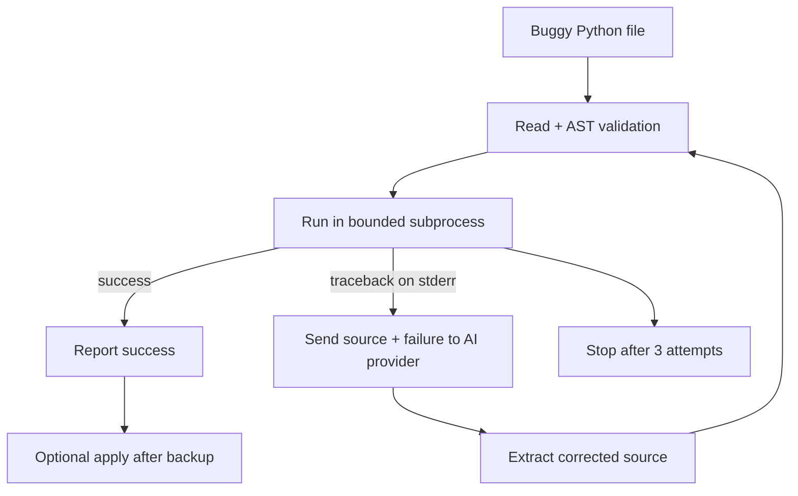

# Day 3 — Autonomous Code Refactoring Agent

A guarded Python agent loop that inspects a `.py` file, validates it with Python's Abstract Syntax Tree (AST), executes it in a bounded subprocess, captures runtime errors, asks Hugging Face Inference Providers for a complete correction, and retries until the file succeeds or three attempts are reached. Groq remains available as an optional provider.

> **Learning project:** this demonstrates an agent feedback loop. It is not a production sandbox. Never run untrusted code without isolation, and review model-generated changes before using them.

## What this demonstrates

- AST syntax validation before execution.
- Runtime feedback from `subprocess` and captured `stderr`.
- A structured repair prompt sent to Hugging Face or Groq.
- Complete-source extraction from `<fixed_code>` markers.
- A maximum of three repair attempts.
- Timeout protection and output limits.
- Dry-run by default and `.bak` backup before `--apply` replacement.
- Unit tests that do not call Groq.

## Architecture



Detailed diagram: [`docs/architecture.md`](docs/architecture.md).

## Windows setup

PowerShell:

```powershell
cd D:\Day3-autonomous-code-refactoring-agent
py -m venv .venv
.\.venv\Scripts\python.exe -m pip install --upgrade pip
.\.venv\Scripts\python.exe -m pip install -r requirements.txt
```

### Hugging Face (recommended for your setup)

Install the OpenAI-compatible client through `requirements.txt`, then set your Hugging Face token for the current PowerShell window only:

```powershell
$env:HF_TOKEN = "hf_your-token-here"
```

The default model is:

```text
Qwen/Qwen2.5-Coder-32B-Instruct:featherless-ai
```

The `:featherless-ai` suffix explicitly selects the provider, which avoids automatic-routing errors when your Hugging Face account requires explicit provider routing.

Run with Hugging Face:

```powershell
.\.venv\Scripts\python.exe refactor_agent.py examples\buggy_calculator.py --provider huggingface
```

If that model is temporarily unavailable or unsupported for your account, pass another coding model available to your account:

```powershell
.\.venv\Scripts\python.exe refactor_agent.py examples\buggy_calculator.py --provider huggingface --model "Qwen/Qwen2.5-Coder-32B-Instruct:featherless-ai"
```

### Groq (optional)

Set the Groq key for the current PowerShell window only:

```powershell
$env:GROQ_API_KEY = "gsk_your-key-here"
```

Never put the key in the source code or commit it to GitHub.

## Test without an API key

The tests use local temporary files and never call Groq:

```powershell
.\.venv\Scripts\python.exe -m pytest -q
```

## Try the agent in dry-run mode

The CLI uses a temporary working copy and never replaces the original unless `--apply` is supplied:

```powershell
.\.venv\Scripts\python.exe refactor_agent.py examples\buggy_calculator.py
```

The complete CLI loop requires the selected provider credential, `HF_TOKEN` for Hugging Face or `GROQ_API_KEY` for Groq. For an API-free check, use the unit tests above or run `py_compile` on the files.

## Apply a successful fix

After reviewing the behavior, allow replacement with an automatic backup:

```powershell
.\.venv\Scripts\python.exe refactor_agent.py examples\buggy_calculator.py --apply
```

The agent creates:

```text
examples\buggy_calculator.py.bak
```

before it replaces the target. To restore it:

```powershell
Copy-Item examples\buggy_calculator.py.bak examples\buggy_calculator.py -Force
```

Useful controls:

```powershell
.\.venv\Scripts\python.exe refactor_agent.py examples\buggy_calculator.py --provider huggingface --max-attempts 3 --timeout 10
```

## How the loop works

1. Read the target source.
2. Parse it with `ast.parse()` to reject invalid Python before execution.
3. Copy it to a temporary working file.
4. Run it with the current Python interpreter using `subprocess.run()`.
5. Capture `stdout`, `stderr`, exit code, and timeout status.
6. If it fails, send the source and traceback to the selected AI provider.
7. Extract the proposed complete source from `<fixed_code>`.
8. Parse the proposal again with `ast`.
9. Re-run it, stopping on success or after three attempts.
10. Only with `--apply`, copy the successful version back after creating `.bak`.

AST is excellent for syntax and structural checks, but it cannot prove that business logic is correct. Runtime execution and tests provide the feedback used by this prototype.

## Cost and privacy

Hugging Face Inference Providers and Groq may have current usage limits, credits, or pricing. The source code and captured error output are sent to the selected provider when the repair request is made; do not use confidential code without reviewing the provider's current terms. Tests are local and do not spend API quota.

## License

MIT.
