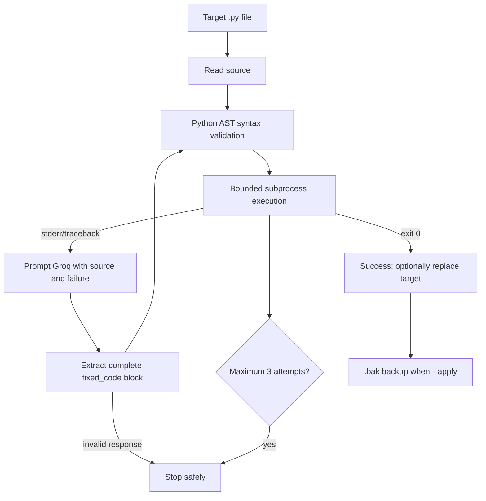

# Architecture

## Safety boundaries

- The target is limited to a Python file.
- The subprocess runs with the current Python interpreter, in the target directory.
- Output is captured and a timeout prevents an infinite loop.
- The default is dry-run: the original file is not replaced.
- `--apply` creates `target.py.bak` before replacing the target after success.
- The model must return a complete source file inside `<fixed_code>` markers.
- Every proposed version is parsed with `ast` before execution.
- The loop stops after at most three attempts.

This is a portfolio learning tool, not a sandbox. Do not run untrusted code or point it at production repositories without isolation, review, and stronger OS-level controls.
